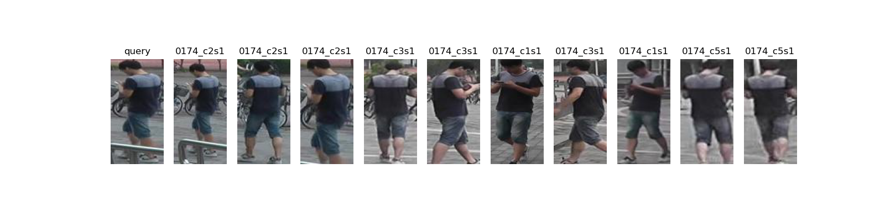

# Re-ID_MGN_Paddlepaddle

## The code 

## Dependencies:

PaddlePaddle==2.1

## Data:

The data structure will be like:

```
data/
    bounding_box_test/
    bounding_box_train/
    gt_bbox/
    gt_query/
    query/
```

## Market1501

You can download dataset from [here](https://pan.baidu.com/s/1FMTwQq9NTXDTxjGwMTj5sA ) .  The password is : RWZW


## Weights

The weights we have already trained can be download [here](https://pan.baidu.com/s/1c-Oavx-caqxXvthe-VtvOg ) .     The password is : jam3


## Train

```
python main.py --mode train --data_path <path/to/Market-1501-v15.09.15>
```

You can find more parameters in opt.py

## Evaluate

You can use our weight or your trained weight

```
python main.py --mode evaluate --data_path <path/to/Market-1501-v15.09.15> --weight <path/to/weight_name.pdparams>
```

## Visualize

```
python main.py --mode vis --query_image <path/to/query_image> --weight <path/to/weight_name.pdparams>
```

Visualize rank10 query result from bounding_box_test





## Citation
```
@ARTICLE{2018arXiv180401438W,
    author = {{Wang}, G. and {Yuan}, Y. and {Chen}, X. and {Li}, J. and {Zhou}, X.},
    title = "{Learning Discriminative Features with Multiple Granularities for Person Re-Identification}",
    journal = {ArXiv e-prints},
    year = 2018,
}

https://github.com/GNAYUOHZ/ReID-MGN
```
